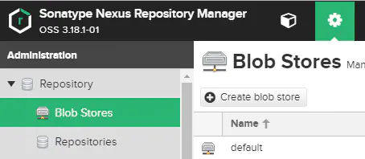
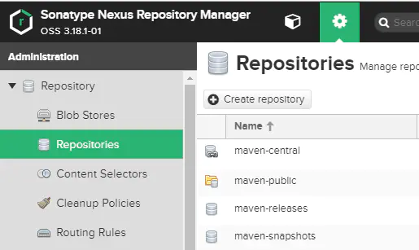
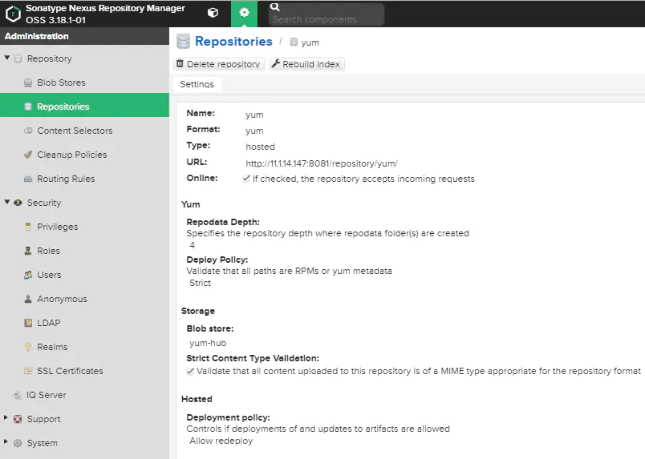
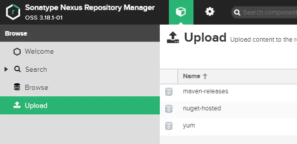
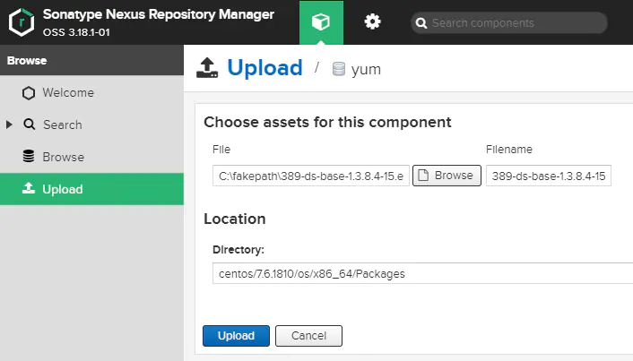
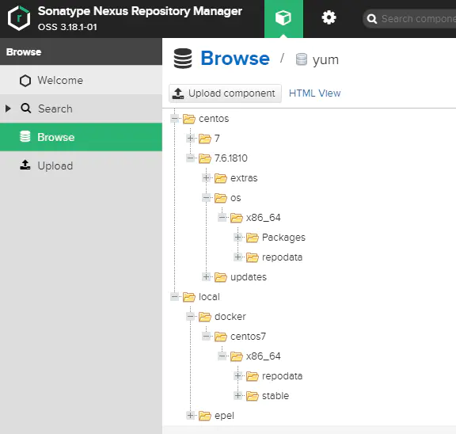

# centos离线安装ansible


## 安装步骤 

* 安装私有yum源
* 挂载centos镜像
* 上传rpm包
* 配置私有yum源


## 安装私有yum源

[参考文章](https://gitee.com/nickqiu/notes-everything/blob/master/docs/Nexus3/docs/docker_install.md)


## 挂载centos镜像

```bash 
# 假设镜像目录为 /root/CentOS-7-x86_64-DVD-1810.iso
mkdir -p /data/centos
mount -t iso9660 /root/CentOS-7-x86_64-DVD-1810.iso /data/centos
# 开机自动挂载iso文件 
# echo "/root/CentOS-7-x86_64-DVD-1810.iso /data/centos iso9660 loop 0 0" >> /etc/fstab
# 取消挂载 
# 删除配置文件  /etc/fstab
# umount /opt/centos 

```


## 上传rpm包

## 配置私有yum源

### 新建yum源

* 新增Blob Stores，管理员登陆控制台，在配置界面，点击 Blob Stores->Create blob store



* 新增Repositories，管理员登陆控制台，在配置界面，点击Repositories->Create repository

  

* 新增yum源，类型选择hosted，Repodata Depth设置为4，如下图所示：

  


## 手动少量同步rpm

* 通过管理界面手动增加rpm包，如果是少量rpm包，建议手动增加，操作如下，在Upload界面，点击yum源名称，选择rpm包及指定上传路径

 



  

### 批量同步rpm

* 同步外网的yum源之后，将源中的文件通过脚本同步到nexus3中，os目录的脚本如下所示，***为密码    
```bash 
#! /bin/bash
for i in `ls /data/centos/base/Packages`;
do curl -v --user 'admin:***' --upload-file /data/centos/base/Packages/$i http://11.1.14.147:8081/repository/yum/centos/7.6.1810/os/x86_64/Packages/$i;
done
```
> /opt/CentOS/base/Packages目录是本地存放rpm包的目录。

* epel目录结构有分层，脚本如下所示  

```bash 
#! /bin/bash
for i in `find /data/centos/epel/Packages -type f`;
do curl -v --user 'admin:***' --upload-file $i http://11.1.14.147:8081/repository/yum/local/epel/7/x86_64/Packages/${i:38};
done
```


### 配置私有yum源 


```bash 

# 备份默认源
mkdir /root/centos-yum.bak
mv /etc/yum.repos.d/* /root/centos-yum.bak/

# http://11.1.14.147:8081/repository/yum/centos/7.6.1810/os/x86_64/Packages/$i;

# 源文件配置
cat << EOF >/etc/yum.repos.d/upcentos7.repo
[upcentos7]
name=upcentos7
# baseurl= http://192.168.176.181:8081/repository/centos7-163/
baseurl= http://11.1.14.147:8081/repository/yum/centos
enabled=1
gpgcheck=0
# gpgkey=http://mirrors.163.com/centos/RPM-GPG-KEY-CentOS-7
priority=1
EOF

# 清除缓存
yum clean all 
yum makecache
# 列出了yum包
yum list  java
# 查看yum仓库列表,查看会返回有upcentos7的源
yum repolist

```

### 安装ansible 

```bash 
yum install ansible
```